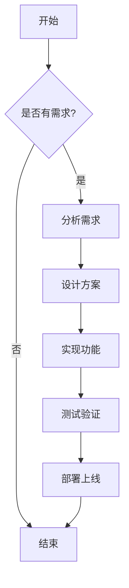
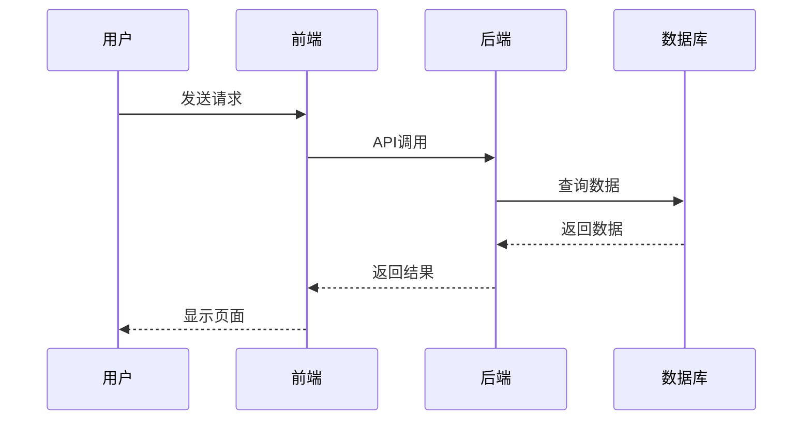
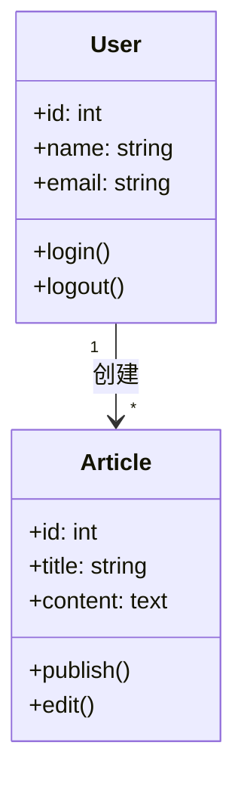
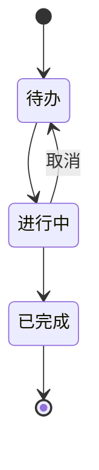
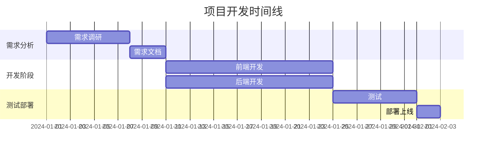

# Mermaid 图表示例

本页面展示了如何在知识库中使用 Mermaid 图表。

## 流程图

```mermaid
graph TD
    A[开始] --> B{是否有需求?}
    B -->|是| C[分析需求]
    B -->|否| D[结束]
    C --> E[设计方案]
    E --> F[实现功能]
    F --> G[测试验证]
    G --> H[部署上线]
    H --> D
```

## 时序图

```mermaid
sequenceDiagram
    participant 用户
    participant 前端
    participant 后端
    participant 数据库
    
    用户->>前端: 发送请求
    前端->>后端: API调用
    后端->>数据库: 查询数据
    数据库-->>后端: 返回数据
    后端-->>前端: 返回结果
    前端-->>用户: 显示页面
```

## 类图

```mermaid
classDiagram
    class User {
        +id: int
        +name: string
        +email: string
        +login()
        +logout()
    }
    
    class Article {
        +id: int
        +title: string
        +content: text
        +publish()
        +edit()
    }
    
    User "1" --> "*" Article : 创建
```

## 状态图

```mermaid
stateDiagram-v2
    [*] --> 待办
    待办 --> 进行中
    进行中 --> 已完成
    进行中 --> 待办: 取消
    已完成 --> [*]
```

## 甘特图

```mermaid
gantt
    title 项目开发时间线
    dateFormat  YYYY-MM-DD
    section 需求分析
    需求调研   :a1, 2024-01-01, 7d
    需求文档   :a2, after a1, 3d
    
    section 开发阶段
    前端开发   :b1, after a2, 14d
    后端开发   :b2, after a2, 14d
    
    section 测试部署
    测试       :c1, after b1, 7d
    部署上线   :c2, after c1, 2d
```