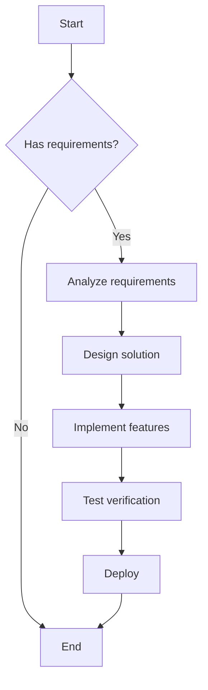
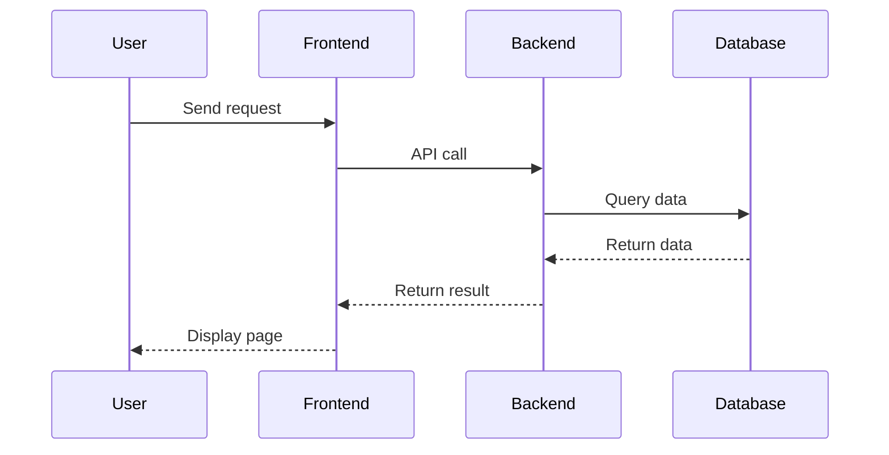
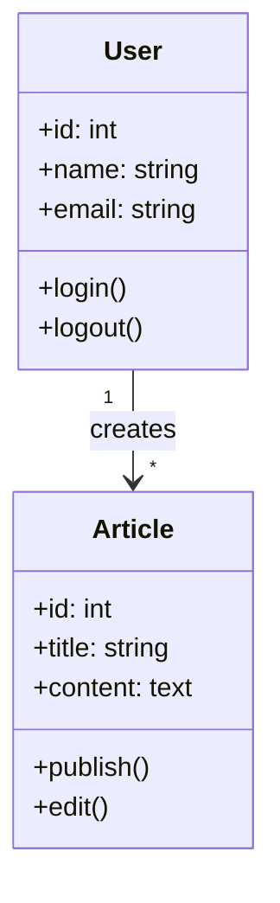
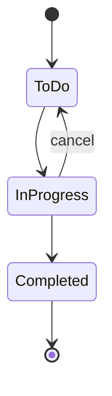
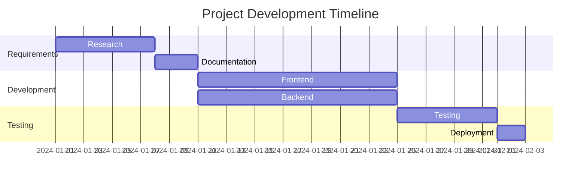

# Mermaid Chart Examples

This page demonstrates how to use Mermaid charts in the knowledge base.

## Flowchart

```mermaid
graph TD
    A[Start] --> B{Has requirements?}
    B -->|Yes| C[Analyze requirements]
    B -->|No| D[End]
    C --> E[Design solution]
    E --> F[Implement features]
    F --> G[Test verification]
    G --> H[Deploy]
    H --> D
```

## Sequence Diagram

```mermaid
sequenceDiagram
    participant User
    participant Frontend
    participant Backend
    participant Database
    
    User->>Frontend: Send request
    Frontend->>Backend: API call
    Backend->>Database: Query data
    Database-->>Backend: Return data
    Backend-->>Frontend: Return result
    Frontend-->>User: Display page
```

## Class Diagram

```mermaid
classDiagram
    class User {
        +id: int
        +name: string
        +email: string
        +login()
        +logout()
    }
    
    class Article {
        +id: int
        +title: string
        +content: text
        +publish()
        +edit()
    }
    
    User "1" --> "*" Article : creates
```

## State Diagram

```mermaid
stateDiagram-v2
    [*] --> ToDo
    ToDo --> InProgress
    InProgress --> Completed
    InProgress --> ToDo: cancel
    Completed --> [*]
```

## Gantt Chart

```mermaid
gantt
    title Project Development Timeline
    dateFormat  YYYY-MM-DD
    section Requirements
    Research   :a1, 2024-01-01, 7d
    Documentation   :a2, after a1, 3d
    
    section Development
    Frontend   :b1, after a2, 14d
    Backend   :b2, after a2, 14d
    
    section Testing
    Testing       :c1, after b1, 7d
    Deployment   :c2, after c1, 2d
```